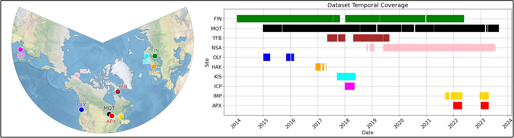

Datasets
=====

DeepBlue
------------

A Comprehensive Northern Hemisphere Particle Microphysics Dataset from the Precipitation Imaging Package

The data for this project is hosted online on the University of Michigan's `DeepBlue repository <https://deepblue.lib.umich.edu/data/concern/data_sets/kk91fm40r?locale=en>`_.

We have collected PIP microphysical data from a variety of measurement locations across the northern hemisphere. Data originally in a proprietary ASCII format has been converted to the more universally recognized NetCDF-4 format for ease of sharing and compatibility within the academic community. The conversion process, undertaken using a combination of bash and Python, ensures broader compatibility with various data analysis tools and platforms. A quality assurance (QA) procedure has been undertaken to ensure the integrity of the data. Post QA, the data is transformed into daily NetCDF-4 files following the Climate and Forecast (CF) conventions (version 1.10) and compressed with a level 2 deflation for optimized file size. Additional details into the data curation process can be found in our journal article publication.

For a brief overview of the data study sites and coverage periods, please see the figure below.

